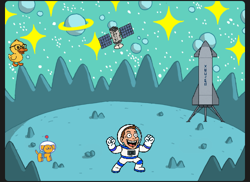
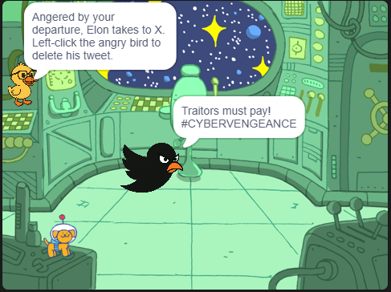
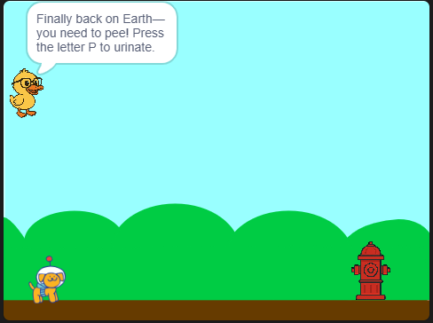

# 🎮 Escape from Elon

Arcade-style game originally built in **Scratch**, packaged with **TurboWarp** for smooth web play.

---

## 🐾 Game Overview
- **Scene 1: PlanetX** – Guide Dot the dog to the Starship while dodging Elon and plasma balls.  
- **Scene 2: Spaceship** – Delete angry tweets!  
- **Scene 3: Earth** – Relieve yourself once back on Earth..  

---

## 📸 Screenshots

**Scene 1: PlanetX**  

**Scene 2: Starship Interior**  

**Scene 3: Earth**  

## ▶ Play the Game
👉 [Play Escape from Elon on Scratch](https://scratch.mit.edu/projects/1192573699)  

Or try the GitHub Pages build:  
👉 [Play on GitHub Pages](https://corruptedconsciousness.github.io/escape-from-elon/)  

---

## 🛠 Tech
- Built with **Scratch 3**  
- Exported with **TurboWarp Packager** → standalone HTML  
- Hosted on **GitHub Pages**  

---

## ✨ About
This project is part of my AI/CS journey — a playful demo showing creativity, logic, and interactive design.  
